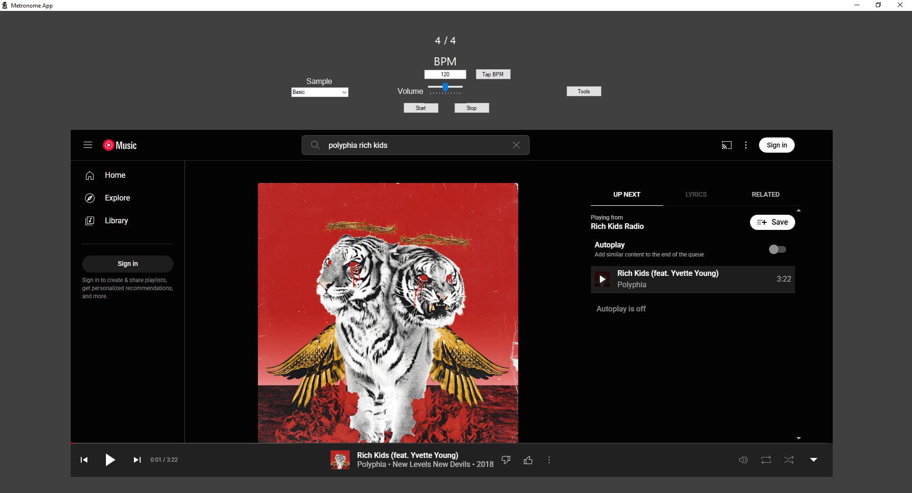

# Project Overview
This Metronome Application is written in C# using Windows Forms .NET. It is a simple metronome that accommodates custom beats per minute and time signatures, and offers tap tempo, multiple different metronome samples, a volume slider, and an embedded YouTube Music player. This project is a solo personal project that I created so that I wouldn't have to always have two separate applications or browser windows open when practicing an instrument.

# File Navigation
The main code file is MetronomeForm.cs, which can be found under MetronomeApp\MetronomeForm.cs.

# Preview Image
## Main Form

## Tools
  
The tools form hosts links to other music-related tools offered by the application.

## Songs to Learn
  
The songs to learn list is saved to a system setting when the Save button is pressed which is loaded and populates the text box on form initialization.
